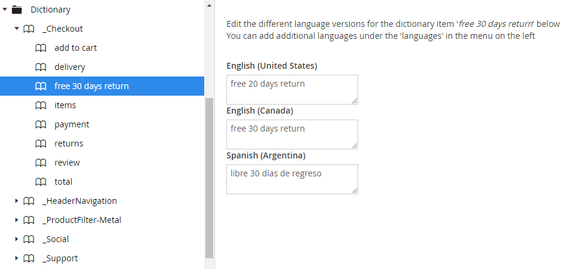

---?image=/img/background.png&size=cover&opacity=20

---?color=#000000
## @color[orange](A multilingual site using a CMS)

@ul
 - Structuring your content for more than one language
 - Ensuring adding another language wont kill your team or their productivity
 - Everything in another language is optional
@ulend

+++?color=#000000
## @color[#DC143C](What this isn't about, is)

@ul
 - Google Translation Services & APIs
 - Amazon Translate
 - In browser translation
@ulend

---?color=#000000
## @color[orange](Multilingual Content)

+++?color=#000000
### @color[#DC143C](Most CMS implementions are like this)

---?image=/img/dual-language-site2.png

---?image=/img/dual-language-site2.png

---?image=/img/dual-language-site3.png&

+++?color=#000000
### @color[orange]Instead use horizontal content replication


    Which means what?

+++?color=#000000
### @color[yellow](Show & Tell)

---?color=#000000
## @color[orange](Multilingual Text)

+++?color=#000000
### @color[orange](Dictionary Based Content)




+++?color=#000000
### @color[orange](In Code)

Use of dicionary for every instance of text
```
@inherits UmbracoViewPage<ContentModels.Page>
@{
    var close = Model.GetDictionaryValue("close");
    var telephone = Model.GetDictionaryValue("telephone");
    var search = Model.GetDictionaryValue("search");
}
```

+++?color=#000000
### @color[orange](In Code)

Use of dicionary for every instance of output
```
<ul class="Header-nav list-inline">
    @foreach (var menuItem in menuItems.Where(m => m.Visible))
    {
        var menuName = Model.GetDictionaryValue(menuItem.Name);

        <li "class=Header-link")>
        <a title="@menuName" href="@menuItem.Url">@menuName</a>
        </li>
    }
</ul>
```

+++?color=#000000
## @color[red](The End)
