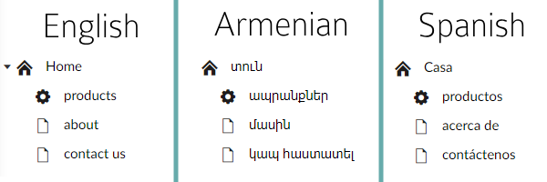

---?image=/img/background.png&size=cover&opacity=20

---?color=#000000
## @color[orange](The do's & dont's of 
### A multilingual site using a CMS)

@ul
 - @fa[fa-check-square orange](Structuring your content for more than one language)
 - @fa[fa-check-square orange](Ensuring adding another language wont kill your team or their productivity)
 - @fa[fa-check-square orange](Everything in another language is optional)
@ulend

+++?color=#000000
## @color[#DC143C](What this isn't about, is)

@ul
 - @fa[fa-times-square #DC143C](Google Translation Services & APIs)
 - @fa[fa-times-square #DC143C](Amazon Translate)
 - @fa[fa-times-square #DC143C](In browser translation)
@ulend

---?color=#000000
## @color[orange](Multilingual Content)

+++?color=#000000
### @color[#DC143C]Most CMS implementions are like this
@quote[vertical content replication suxs]
---?image=img/dual-language-site1.png&size=contain&transition=none

---?image=img/dual-language-site2.png&size=contain&transition=none

---?image=img/dual-language-site3.png&size=contain&transition=none

+++?color=#000000
### @color[orange]Instead use horizontal content replication



    Which means what?

+++?color=#000000
### @color[yellow]Show & Tell

---?color=#000000
## @color[orange](Multilingual Text)

+++?color=#000000
### Dictionary Based Content


+++?color=#000000
### In Code
Use of dicionary for every instance of text
```
@inherits UmbracoViewPage<ContentModels.Page>
@{
    var close = Model.GetDictionaryValue("close");
    var telephone = Model.GetDictionaryValue("telephone");
    var search = Model.GetDictionaryValue("search");
}

    <ul class="Header-nav list-inline">
        @foreach (var menuItem in menuItems.Where(m => m.Visible))
        {
            var menuName = Model.GetDictionaryValue(menuItem.Name);

            <li "class=Header-link")>
            <a title="@menuName" href="@menuItem.Url">@menuName</a>
            </li>
        }
    </ul>
```
@[1-6] @[7-17]

+++?color=#000000
## The End


